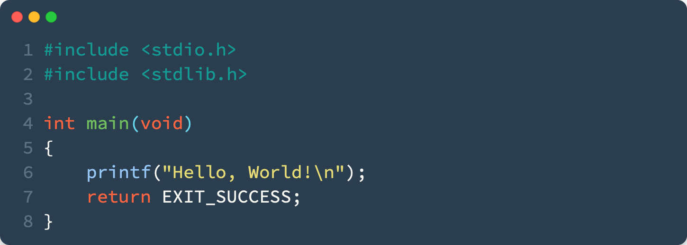

Sample file
20/03/2023
Vergazon
meta, example

This file is a sample of what a markdown file **should look like**. It is used to test the compiler. Not every markdown feature is supported, but the most common ones are (headers, codeblocks, links, images, lists, etc.). Every component is styled accordingly to the theme. If a Markdown feature is not featured in this file, it is probably not supported.

# An h1 header

Paragraphs are separated by a blank line.

2nd paragraph. _Italic_, **bold**, and `monospace`.

Itemized lists look like:

-   this one
-   that one
-   the other one

Note that --- not considering the asterisk --- the actual text
content starts at 4-columns in.

> Block quotes are
> written like so.
>
> They can span multiple paragraphs,
> if you like.

Use 3 dashes for an em-dash. Use 2 dashes for ranges (ex., "it's all
in chapters 12--14"). Three dots ... will be converted to an ellipsis.
Unicode is supported. ☺

## An h2 header

Here's a numbered list:

1.  first item
2.  second item
3.  third item

Note again how the actual text starts at 4 columns in (4 characters
from the left side). Here's a code sample:

    # Let me re-iterate ...
    for i in 1 .. 10 { do-something(i) }

As you probably guessed, indented 4 spaces. By the way, instead of
indenting the block, you can use delimited blocks, if you like:

    define fooBar(self):
        print(self.text)

(which makes copying & pasting easier). You can optionally mark the
delimited block for Pandoc to syntax highlight it:

### An h3 header

Now a nested list:

1.  First, get these ingredients:

    -   carrots
    -   celery
    -   lentils

2.  Boil some water.

3.  Dump everything in the pot and follow
    this algorithm:

        find wooden spoon
        uncover pot
        stir
        cover pot
        balance wooden spoon precariously on pot handle
        wait 10 minutes
        goto first step (or shut off burner when done)

    Do not bump wooden spoon or it will fall.

Notice again how text always lines up on 4-space indents (including
that last line which continues item 3 above).

Here's a link to [a website](http://foo.bar), to a [local
doc](local-doc.html), and to a [section heading in the current
doc](#an-h2-header).

and images can be specified like so:

And note that you can backslash-escape any punctuation characters
which you wish to be displayed literally, ex.: \`foo\`, \*bar\*, etc.
